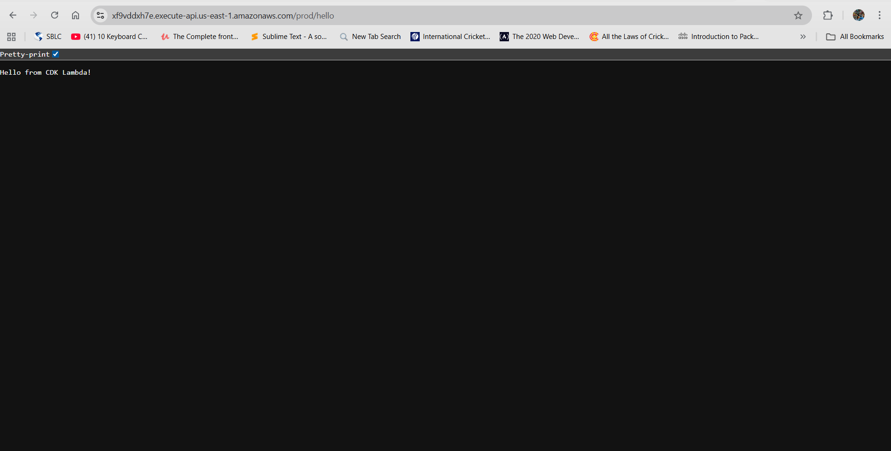
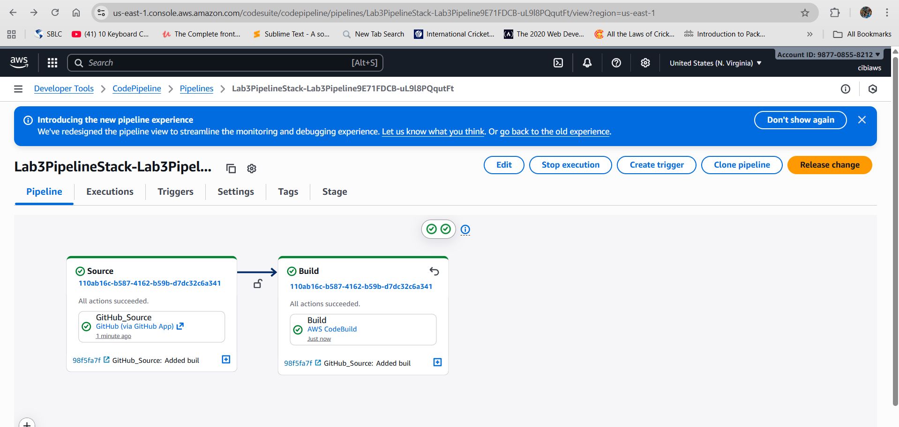
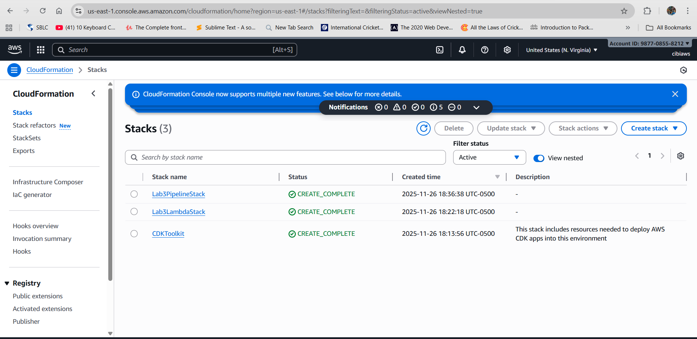
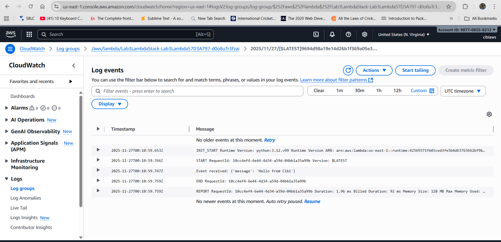
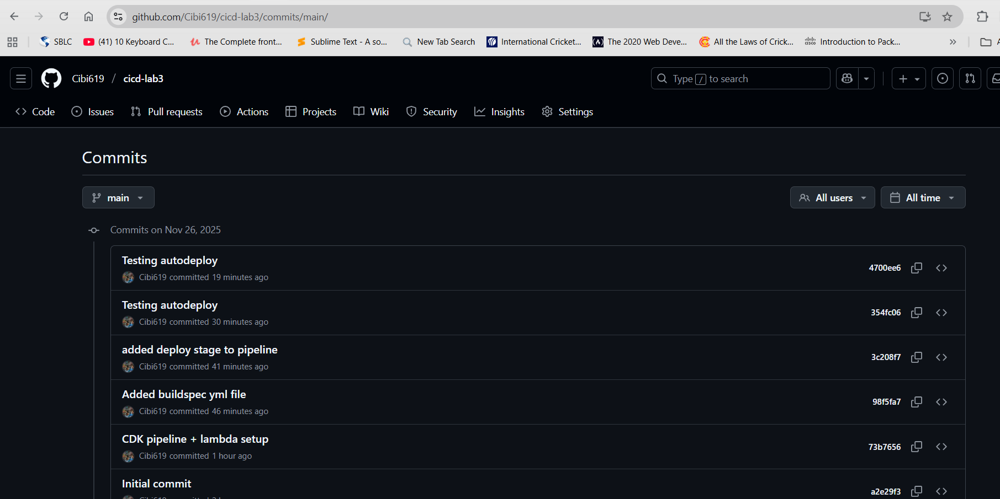
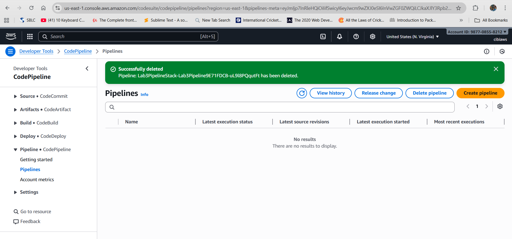
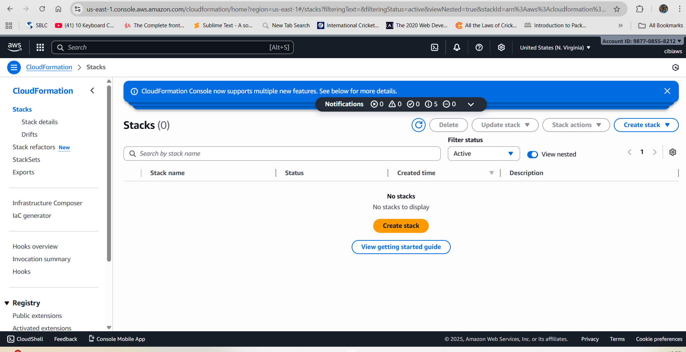

# CI/CD Pipeline for Lambda Deployment using AWS CDK & GitHub

**Name:** Cibi Sharan Cholarani  
**Student ID:** 9015927  

## **Lab Objective**
The goal of this lab was to automate deployment of an AWS Lambda function using a CI/CD pipeline created through **AWS CDK** and triggered through **GitHub source updates**.

This pipeline performs:

| Stage | Service | Purpose |
|-------|---------|---------|
| **Source** | GitHub - CodeStar Connection | Fetches latest code |
| **Build** | AWS CodeBuild | Synthesizes CDK & deploys CloudFormation |
| **Deploy** | CloudFormation (CDK Deploy) | Creates/updates Lambda infrastructure |

## Github Repo Link
```bash
https://github.com/Cibi619/cicd-lab3.git
```

## Screenshots










## Explanation of the Change Made to Trigger Redeployment
To verify that the CI/CD pipeline was working automatically, a small modification was made to the Lambda function source code. The file handler.py was updated by changing the output message.
```bash
return "Hello from Lambda!"
```
## Cleaning up resources


